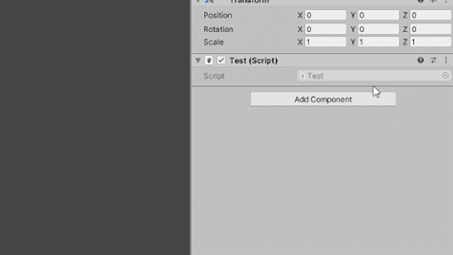

# Editor Script Creator
A simple script to simplify the creation of an editor for MonoBehaviour classes.
Go to the component you want, select the "Create Editor Script" function in the context menu, select your editor folder and you're done!

(It isn't perfect, just a little thing to simplify your work)

